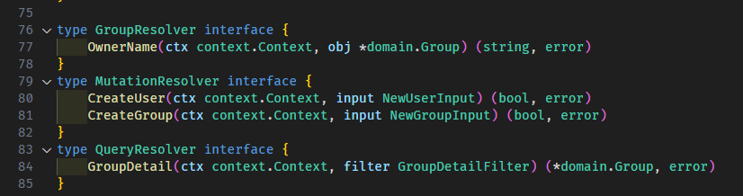
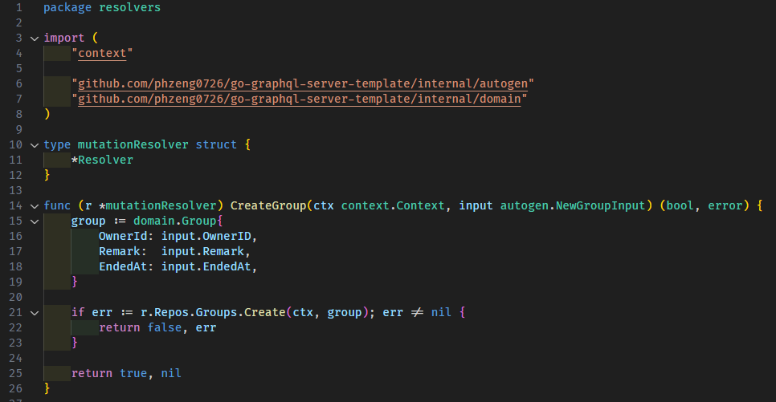
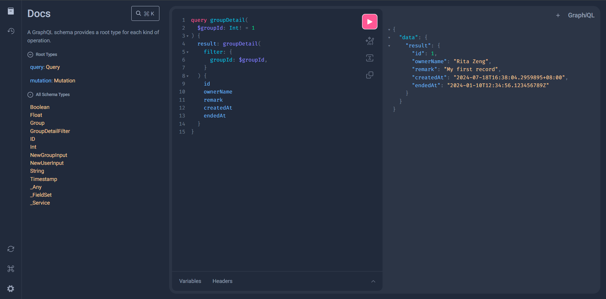

# go-graphql-server-template

## Dependencies

```
<!-- GraphQL API -->
github.com/99designs/gqlgen
github.com/vektah/gqlparser/v2

<!-- Others -->
gorm.io/gorm
gorm.io/driver/sqlite
github.com/joho/godotenv
```

## How to Develop?

### Prepare

- `.env`

  ```
  ENV="development"
  HOST=0.0.0.0
  PORT=8080
  ```

### Before Setting Up GraphQL

1. Clone this project or use it as a template.
2. Build your domain and repository layers as needed.

### Setting Up GraphQL

1. Create `gplgen.yml` in the same directory as `go.mod`
2. Build `*.graphql` files in the `/graphql` folder and define your GraphQL inputs and models.
3. Add **queries** and **mutations** in `schema.graphql`.
4. Run the following command to generate `/internal/autogen`:
   ```powershell=
   go get github.com/99designs/gqlgen@v0.17.49; go run github.com/99designs/gqlgen
   ```
   The autogen will generate many `Resolver` interfaces, such as `QueryResolver`, `MutationResolver` and others.
   
5. Go to `/internal/resolvers`，and implement business logic using the interfaces generated by autogen.
   

### Testing on playground

1. Run this project with `cd .\server\cmd\` and `go run .\main.go`
2. Open the GraphQL playground with http://0.0.0.0:8080/
   

### Example

#### Mutation

```graphql=
mutation createUser(
  $userId: String! = "user0001"
  $username: String! = "Rita Zeng",
) {
  createUser(
    input: {
      userId: $userId,
      username: $username,
    }
  )
}

mutation createGroup(
  $ownerId: String! = "user0001"
  $remark: String! = "My first record",
  $endedAt: Timestamp! = "2024-01-10T12:34:56.123456789Z",
) {
  createGroup(
    input: {
      ownerId: $ownerId,
      remark: $remark,
      endedAt: $endedAt
    }
  )
}
```

#### Query

```graphql=
query groupDetail(
  $groupId: Int! = 1
) {
  result: groupDetail(
    filter: {
      groupId: $groupId,
    }
  ) {
    id
    ownerName
    remark
    createdAt
    endedAt
  }
}
```
